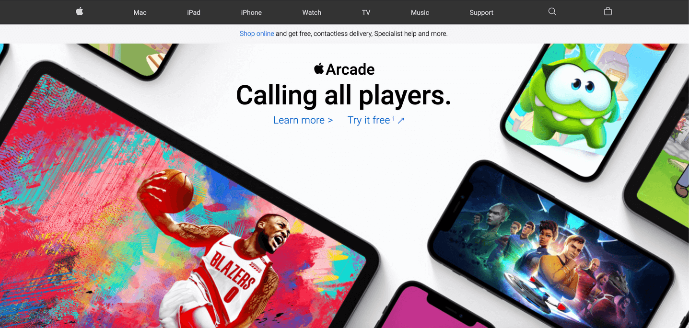

## Table of contents

- [Overview](#overview)
  - [Screenshot](#screenshot)
  - [Links](#links)
- [My process](#my-process)
  - [Built with](#built-with)
  - [Tools used](#tools-used)
  - [Project Description](#project-description)
  - [Plugins](#Plugins)
- [Author](#author)

## Overview

### Screenshot

### Links

- Solution URL: [View Code](https://github.com/Rabin92/apple-homepage-clone/tree/main)
- Live Site URL: [Go Live](https://apple-homepage-clone.vercel.app)

## My process

### Built with

- Semantic HTML5 markup
- Sass
- [JavaScript](https://javascript.info) - Vanilla JS
- [Flexbox](https://css-tricks.com/snippets/css/a-guide-to-flexbox/) - CSS Flexbox
- [Grid](https://css-tricks.com/snippets/css/complete-guide-grid/) - CSS Grid
- Mobile-first Responsive Design
- SVG

### Tools used

- Visual Studio Code
- Git
- GitHub
- Chrome DevTools

### Project Description

I cloned Apple website homepage (UK) from scratch using HTML5, CSS3, Sass, and vanilla JavaScript.

### Plugins

- [Hamburger Animation](https://jonsuh.com/hamburgers/)
- [Open Source Icons](https://ionicons.com)

## Author

- Website - [Rabin Gharti Magar](https://www.rabingm.dev/)
- Frontend Mentor - [@Rabin92](https://www.frontendmentor.io/profile/Rabin92)
